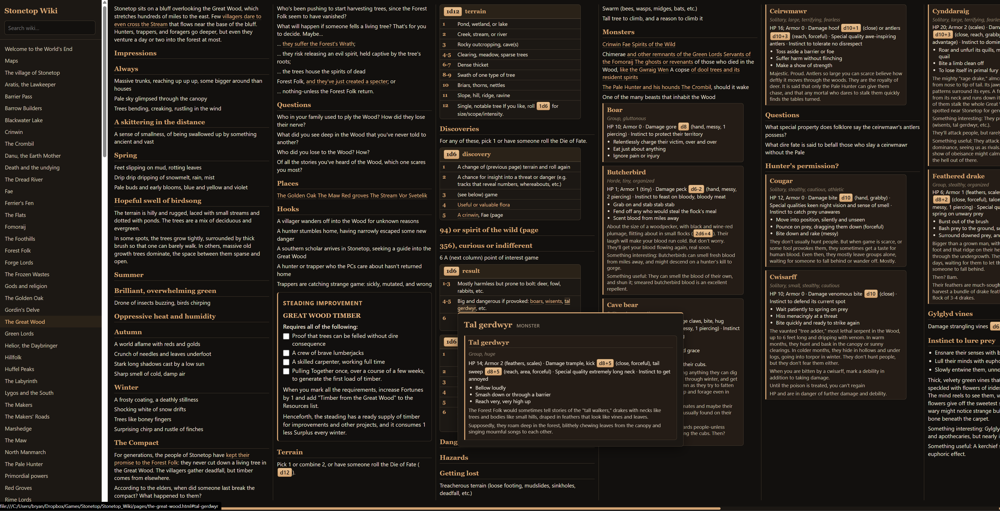
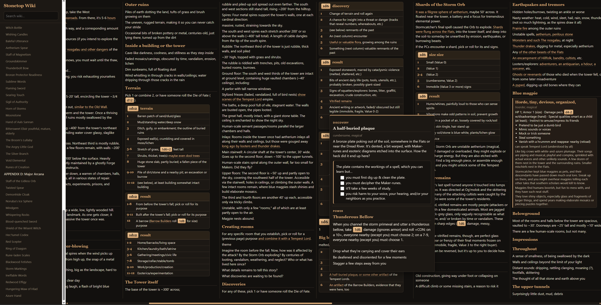

# Stonetop Wiki Generator

Generate a **static, offline wiki** from the *Stonetop* Book II PDF (*The Wider World and Other Wonders*).

The wiki includes:

- Gazetteer pages (places, peoples, powers)
- Minor & major arcana as interactive cards (checkboxes for unlocks / progress / consequences)
- Full-text search, hover previews, and dice rollers
- Deep links between page references and monster/stat blocks
- Maps rendered from the PDF (optional high-res campaign sheets)

> **This repository does not include the Stonetop PDFs, artwork, or a pre-built wiki.**  
> You need a legal copy of the Book II **1-up** PDF from [the official Stonetop store](https://plusoneexp.com/collections/stonetop).





## Requirements

- **Python 3.10+** (3.11+ recommended)
- The Book II PDF (**1-up**, 2nd printing works well):

  ```
  Book_II_-_The_Wider_World_and_Other_Wonders_(1-up)_-_2nd_printing.pdf
  ```

## Quick start

### 1. Clone and install

```bash
git clone https://github.com/Bryan-Legend/stonetop-wiki-generator.git
cd stonetop-wiki-generator

python -m venv .venv

# Windows
.venv\Scripts\activate

# macOS / Linux
source .venv/bin/activate

pip install -r requirements.txt
```

### 2. Add your PDF

Copy the Book II **1-up** PDF into this folder so the path is:

```text
stonetop-wiki-generator/
  Book_II_-_The_Wider_World_and_Other_Wonders_(1-up)_-_2nd_printing.pdf
  build_book_ii_wiki.py
  wiki_content.py
  …
```

The filename must match exactly (the script looks for that name).

### 3. Build the wiki

```bash
python build_book_ii_wiki.py
```

This creates `Stonetop_Wiki/` next to the script (HTML, CSS, JS, map images from the PDF).

### 4. Open it

Open in a browser:

```text
Stonetop_Wiki/index.html
```

Or serve locally (avoids some `file://` restrictions):

```bash
# Python
cd Stonetop_Wiki
python -m http.server 8000
# then visit http://localhost:8000
```

## Optional: campaign map sheets

If you own the separate campaign map images, put them under a `Maps/` folder (any nesting is fine). The generator looks for files named like `Map *.jpg` / `Map *.png` and lists them on the Maps page **before** the PDF spreads.

```text
Maps/
  Map 1 - Stonetop.jpg
  Map 2 - Vicinity.jpg
  …
```

## What gets generated

| Path | Contents |
|------|----------|
| `Stonetop_Wiki/index.html` | Home / topic index |
| `Stonetop_Wiki/pages/*.html` | One page per article / arcanum |
| `Stonetop_Wiki/css/wiki.css` | Styles |
| `Stonetop_Wiki/js/` | Search, checkboxes, dice, previews |
| `Stonetop_Wiki/images/maps/` | Map images |

Checkbox state for steading improvements and arcana is stored in your browser (`localStorage`).

## Project files

| File | Role |
|------|------|
| `build_book_ii_wiki.py` | Main entry point — builds the static site |
| `wiki_content.py` | PDF extraction, structure, linkify, arcana parsing |
| `requirements.txt` | Python dependencies |
| `docs/wiki-screenshot-*.png` | README screenshots |

## Troubleshooting

**`PDF not found`**  
Check the PDF filename and that it sits in the same directory as `build_book_ii_wiki.py`.

**Build is slow / uses a lot of RAM**  
Normal for a ~500-page PDF with map renders. Give it a minute; maps are the heavy step.

**Maps page only has PDF spreads**  
That’s expected without a `Maps/` folder of campaign sheets.

**Search / previews don’t work over `file://`**  
Use a local static server (`python -m http.server`) as shown above.

## License

The **generator code** in this repository is MIT (see [LICENSE](LICENSE)).

*Stonetop* and its text/art are © their respective owners (Jeremy Strandberg / the Stonetop team). This project only helps **you** turn a PDF you own into a personal reference wiki. Do not redistribute the PDFs, the extracted text, or a built wiki that contains the book’s content.

## Credits

Built for table use with the *Stonetop* RPG. Not affiliated with the official Stonetop publishers.
