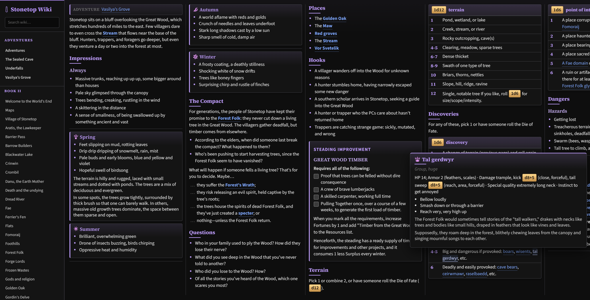
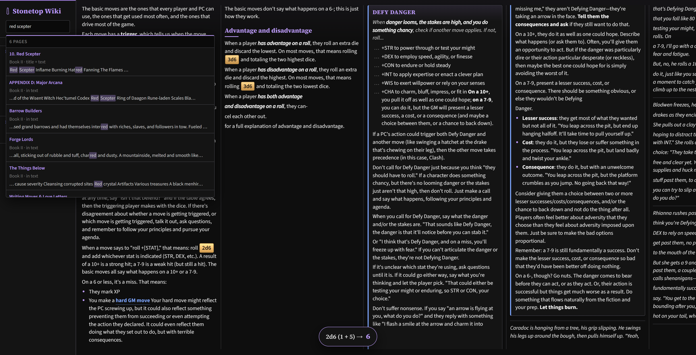

# Stonetop Wiki Generator

Generate a **static, offline wiki** from the *Stonetop* PDFs.

The wiki includes:

- Articles (moves, places, peoples, powers, …)
- Minor & major arcana as interactive cards (checkboxes for unlocks / progress / consequences)
- Map views with a waypoint pin label editor
- Full-text search, hover previews, and dice rollers
- Deep links between page references and monster/stat blocks
- Adventure sheets under `Stonetop_Wiki/adventures/` with dice rollers, hp trackers, & deep linking rich popups

> **This repository does not include the Stonetop PDFs, extracted book text, or map art.**  
> You need a legal copy of the PDFs from [the official Stonetop store](https://plusoneexp.com/collections/stonetop).

## Screenshots





## Requirements

- **Python 3.10+** (3.11+ recommended)
- Book **1-up** PDFs (2nd printing works well).

## Quick start

### 1. Clone and install

```bash
git clone https://github.com/Bryan-Legend/stonetop-wiki-generator.git
cd stonetop-wiki-generator

python -m venv .venv

# Windows
.venv\Scripts\activate

# macOS / Linux
source .venv/bin/activate

pip install -r requirements.txt
```

### 2. Point at your PDFs and build

Put the 1-up PDFs in an input folder (optional `Maps/` subfolder for campaign map sheets), then:

```bash
python stonetop-wiki-generator.py --input /path/to/folder-with-pdfs
```

| Flag | Meaning | Default |
|------|---------|---------|
| `-i` / `--input` | Folder containing the 1-up book PDFs. Optional: `Maps/`. | current working directory |
| `-o` / `--output` | Wiki folder. Chrome and adventures stay in place; only book-derived files are written. | `Stonetop_Wiki/` |
| `--books book1 book2` | Build only the listed books (faster while iterating). | every book PDF found |

```bash
# From a folder that holds the PDFs:
python /path/to/stonetop-wiki-generator/stonetop-wiki-generator.py --input .
```

### 3. Open it

```text
Stonetop_Wiki/index.html
```

Or serve locally (avoids some `file://` restrictions):

```bash
cd Stonetop_Wiki
python -m http.server 8000
# then visit http://localhost:8000
```
## Adventures

Drop HTML sheets in `Stonetop_Wiki/adventures/` (or a subfolder of variants). Each build:

- lists them in the **Adventures** sidebar group and on the home page
- builds an Adventures hub and full-text search entries
- adds a back-link strip on every wiki page a sheet references via `data-slug="…"`

Sheets should link wiki pages as `../pages/<slug>.html` and set `data-wiki-root="../"`. Shared chrome: `adventure.css` and `adventure.js` in the same folder.

Included play-tested Adventures/Sites:

**[Vasilya’s Grove](https://bryan-legend.github.io/stonetop-wiki-generator/Stonetop_Wiki/adventures/Vasilyas-Grove.html)**
**[Underfalls](https://bryan-legend.github.io/stonetop-wiki-generator/Stonetop_Wiki/adventures/Underfalls.html)**

## License

The **generator code** and redistributable wiki chrome in this repository are MIT (see [LICENSE](LICENSE)).

*Stonetop* and its text/art are © their respective owners (Jeremy Strandberg / the Stonetop team). This project only turns a PDF you own into a personal reference wiki. Do not redistribute the PDFs, the extracted text, or a built wiki that contains the book’s content. Not affiliated with the official Stonetop publishers.
